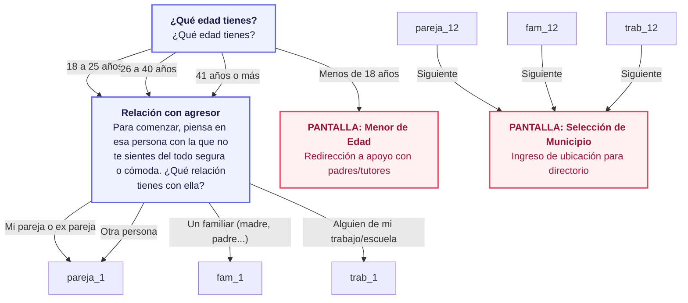

# 📊 Mapa de Flujos de Cuestionarios - REFLEJA

Este documento contiene las representaciones visuales de los flujos de preguntas.
Puedes visualizar estos diagramas de flujo offline usando editores compatibles con Mermaid.js (como VS Code, Obsidian, GitHub) o copiando el código en [Mermaid Live Editor](https://mermaid.live).

## 🗺️ Mapa General de Navegación

## 📌 FLUJO 1: PAREJA O EXPAREJA

```mermaid
flowchart TD
    classDef qNode fill:#f0fdf4,stroke:#22c55e,stroke-width:1.5px,color:#14532d;
    classDef destNode fill:#fff1f2,stroke:#f43f5e,stroke-width:2px,color:#9f1239;
    pareja_1["<b>P1:</b> Después de una discusión fuerte o un episodio<br>difícil, ¿esa persona se vuelve especialmente<br>cariñosa, te da regalos, te promete que todo<br>cambiará y actúa como la pareja perfecta?"]:::qNode
    pareja_2["<b>P2:</b> ¿Sientes que 'caminas sobre cáscaras de huevo'? Es<br>decir, ¿hay temporadas en las que tienes miedo<br>constante de que algo que digas o hagas provoque<br>una discusión explosiva?"]:::qNode
    pareja_3["<b>P3:</b> ¿Cómo reacciona cuando hay una discusión fuerte?"]:::qNode
    pareja_4["<b>P4:</b> Después del episodio de explosión, ¿te promete que<br>nunca volverá a pasar, te llena de regalos, te<br>busca intensamente para tener relaciones y te dice<br>que no puede vivir sin ti?"]:::qNode
    pareja_5["<b>P5:</b> ¿Has notado que este patrón —tensión, explosión,<br>reconciliación, calma— se repite una y otra vez, y<br>cada vez la situación es peor o más intensa?"]:::qNode
    pareja_6["<b>P6:</b> ¿Controla tu dinero, te prohíbe trabajar, o exige<br>saber en qué gastas cada peso que tienes?"]:::qNode
    pareja_7["<b>P7:</b> ¿Te ha aislado de tu familia y amigos? ¿Tiene<br>problemas si quieres verlos o hablar con ellos?"]:::qNode
    pareja_8["<b>P8:</b> ¿Te ha amenazado con hacer daño a tu familia,<br>mascotas, o con quitarte a tus hijos si intentas<br>dejarlo?"]:::qNode
    pareja_9["<b>P9:</b> ¿Ha destruido cosas tuyas (ropa, documentos,<br>objetos que amas) cuando se enoja?"]:::qNode
    pareja_10["<b>P10:</b> ¿Controla dónde estás todo el tiempo? ¿Te pide que<br>le envíes tu ubicación, o revisa tu historial de<br>ubicación?"]:::qNode
    pareja_11["<b>P11:</b> ¿Te obliga, presiona o manipula para tener<br>relaciones sexuales cuando no quieres?"]:::qNode
    pareja_12["<b>P12:</b> ¿Has pensado en dejarle pero sientes que no<br>puedes? ¿Tienes miedo a lo que pasará si intentas<br>irte?"]:::qNode
    LOCATION["<b>PANTALLA: Selección de Municipio</b>"]:::destNode
    pareja_1 --> |"Sí, siempre después de..."| pareja_2
    pareja_1 --> |"A veces intenta compen..."| pareja_2
    pareja_1 --> |"No, no hay cambios des..."| pareja_2
    pareja_2 --> |"Sí, evito ciertos tema..."| pareja_3
    pareja_2 --> |"A veces noto que hay t..."| pareja_3
    pareja_2 --> |"No, me siento libre de..."| pareja_3
    pareja_3 --> |"Me ha llegado a golpea..."| pareja_4
    pareja_3 --> |"Grita, insulta y a vec..."| pareja_4
    pareja_3 --> |"Discutimos pero al fin..."| pareja_4
    pareja_4 --> |"Sí, promete cambiar, d..."| pareja_5
    pareja_4 --> |"Se disculpa pero no ha..."| pareja_5
    pareja_4 --> |"No, no hay fase de rec..."| pareja_5
    pareja_5 --> |"Sí, es un ciclo que se..."| pareja_6
    pareja_5 --> |"Ha pasado más de una v..."| pareja_6
    pareja_5 --> |"No, esto solo ha pasad..."| pareja_6
    pareja_6 --> |"Sí, tengo que pedirle ..."| pareja_7
    pareja_6 --> |"A veces hace comentari..."| pareja_7
    pareja_6 --> |"No, manejamos nuestro ..."| pareja_7
    pareja_7 --> |"Sí, me ha alejado de m..."| pareja_8
    pareja_7 --> |"A veces pone mala cara..."| pareja_8
    pareja_7 --> |"No, apoya mis relacion..."| pareja_8
    pareja_8 --> |"Sí, ha hecho amenazas ..."| pareja_9
    pareja_8 --> |"Ha mencionado algo sim..."| pareja_9
    pareja_8 --> |"No, nunca ha hecho ame..."| pareja_9
    pareja_9 --> |"Sí, ha roto cosas de v..."| pareja_10
    pareja_9 --> |"Ha roto cosas pero dic..."| pareja_10
    pareja_9 --> |"No, respeta mis perten..."| pareja_10
    pareja_10 --> |"Sí, monitorea constant..."| pareja_11
    pareja_10 --> |"A veces pregunta dónde..."| pareja_11
    pareja_10 --> |"No, respeta mi privacidad"| pareja_11
    pareja_11 --> |"Sí, frecuentemente me ..."| pareja_12
    pareja_11 --> |"A veces insiste despué..."| pareja_12
    pareja_11 --> |"No, respeta mi cuerpo ..."| pareja_12
    pareja_12 --> |"Sí, siento que estoy a..."| LOCATION
    pareja_12 --> |"A veces lo pienso pero..."| LOCATION
    pareja_12 --> |"No, siento que puedo d..."| LOCATION
```

## 📌 FLUJO 2: FAMILIAR (PADRES, HERMANOS, ETC.)

```mermaid
flowchart TD
    classDef qNode fill:#f0fdf4,stroke:#22c55e,stroke-width:1.5px,color:#14532d;
    classDef destNode fill:#fff1f2,stroke:#f43f5e,stroke-width:2px,color:#9f1239;
    fam_1["<b>P1:</b> ¿Constantemente critica tu cuerpo, tus decisiones<br>de vida, te humilla frente a otras personas o te<br>compara negativamente?"]:::qNode
    fam_2["<b>P2:</b> ¿Te amenaza con correrte de la casa, dejar de<br>apoyarte económicamente o quitarte a tus hijos si<br>no haces lo que dice?"]:::qNode
    fam_3["<b>P3:</b> ¿Ha usado la fuerza física (golpes, cachetadas,<br>pellizcos) para castigarte o 'corregirte',<br>justificando que es por tu bien?"]:::qNode
    fam_4["<b>P4:</b> ¿Te controla sobre lo que haces, adónde vas, o con<br>quién hablas? ¿Necesitas pedirle permiso?"]:::qNode
    fam_5["<b>P5:</b> ¿Te ignora, rechaza emocionalmente, o te hace<br>sentir que eres carga para la familia?"]:::qNode
    fam_6["<b>P6:</b> ¿Te ha privado de acceso a educación, medicina, o<br>cosas básicas como castigo?"]:::qNode
    fam_7["<b>P7:</b> ¿Ha tocado tu cuerpo de forma inapropiada o ha<br>hecho comentarios sexuales sobre ti?"]:::qNode
    fam_8["<b>P8:</b> ¿Exige que le obedezcas sin cuestionamientos?<br>¿Castiga si no haces lo que dice?"]:::qNode
    fam_9["<b>P9:</b> ¿Te culpa por problemas familiares o te hace<br>sentir responsable de sus emociones?"]:::qNode
    fam_10["<b>P10:</b> ¿Te ha enviado mensajes amenazantes, las llamadas<br>constantes para controlarte, o te acosa<br>digitalmente?"]:::qNode
    fam_11["<b>P11:</b> ¿Te expone públicamente (redes sociales, familia,<br>vecinos) de forma humillante o compartiendo<br>secretos?"]:::qNode
    fam_12["<b>P12:</b> ¿Sientes que no puedes contar lo que vives en casa<br>a otros por miedo a represalias o vergüenza?"]:::qNode
    LOCATION["<b>PANTALLA: Selección de Municipio</b>"]:::destNode
    fam_1 --> |"Sí, me hace sentir que..."| fam_2
    fam_1 --> |"A veces hace comentari..."| fam_2
    fam_1 --> |"No, mi familia me respeta"| fam_2
    fam_2 --> |"Sí, el chantaje es con..."| fam_3
    fam_2 --> |"Lo ha dicho pero en mo..."| fam_3
    fam_2 --> |"No, nunca me ha amenaz..."| fam_3
    fam_3 --> |"Sí, me ha lastimado fí..."| fam_4
    fam_3 --> |"No me ha golpeado a mí..."| fam_4
    fam_3 --> |"No, jamás ha usado vio..."| fam_4
    fam_4 --> |"Sí, tiene control sobr..."| fam_5
    fam_4 --> |"A veces me cuestiona s..."| fam_5
    fam_4 --> |"No, respeta mi indepen..."| fam_5
    fam_5 --> |"Sí, constantemente me ..."| fam_6
    fam_5 --> |"A veces es indiferente..."| fam_6
    fam_5 --> |"No, muestra interés en..."| fam_6
    fam_6 --> |"Sí, me ha negado acces..."| fam_7
    fam_6 --> |"A veces limita mi acce..."| fam_7
    fam_6 --> |"No, me proporciona lo ..."| fam_7
    fam_7 --> |"Sí, ha habido tocamien..."| fam_8
    fam_7 --> |"Ha hecho comentarios i..."| fam_8
    fam_7 --> |"No, jamás ha pasado"| fam_8
    fam_8 --> |"Sí, exige obediencia a..."| fam_9
    fam_8 --> |"A veces se molesta si ..."| fam_9
    fam_8 --> |"No, podemos hablar y l..."| fam_9
    fam_9 --> |"Sí, constantemente me ..."| fam_10
    fam_9 --> |"A veces me hace sentir..."| fam_10
    fam_9 --> |"No, entiende la difere..."| fam_10
    fam_10 --> |"Sí, me acosa constante..."| fam_11
    fam_10 --> |"A veces me envía mensa..."| fam_11
    fam_10 --> |"No, respeta mi espacio..."| fam_11
    fam_11 --> |"Sí, me ha expuesto púb..."| fam_12
    fam_11 --> |"A veces menciona cosas..."| fam_12
    fam_11 --> |"No, respeta mi privacidad"| fam_12
    fam_12 --> |"Sí, tengo que guardar ..."| LOCATION
    fam_12 --> |"Me cuesta trabajo habl..."| LOCATION
    fam_12 --> |"No, me siento segura c..."| LOCATION
```

## 📌 FLUJO 3: TRABAJO O ESCUELA

```mermaid
flowchart TD
    classDef qNode fill:#f0fdf4,stroke:#22c55e,stroke-width:1.5px,color:#14532d;
    classDef destNode fill:#fff1f2,stroke:#f43f5e,stroke-width:2px,color:#9f1239;
    trab_1["<b>P1:</b> ¿Se burla de tu trabajo, te asigna tareas<br>imposibles a propósito o te amenaza constantemente<br>con despedirte o reprobarte sin razón?"]:::qNode
    trab_2["<b>P2:</b> ¿Te ha hecho comentarios con doble sentido,<br>insinuaciones sexuales, o te ha tocado de forma<br>inapropiada sin tu consentimiento?"]:::qNode
    trab_3["<b>P3:</b> ¿Te aísla del equipo? ¿Los demás compañeros no te<br>hablan o te excluyen de actividades?"]:::qNode
    trab_4["<b>P4:</b> ¿Te retiene información importante o no te permite<br>acceso a recursos que necesitas para trabajar<br>bien?"]:::qNode
    trab_5["<b>P5:</b> ¿Supervisa tu trabajo de forma obsesiva o revisa<br>constantemente lo que haces?"]:::qNode
    trab_6["<b>P6:</b> ¿Ha usado tu orientación sexual, género, religión,<br>origen o apariencia física para burlarse de ti?"]:::qNode
    trab_7["<b>P7:</b> ¿Ha prometido ascensos, beneficios o mejor trato a<br>cambio de favores sexuales o acciones que no son<br>laborales?"]:::qNode
    trab_8["<b>P8:</b> ¿Ha rondado mi escritorio, me ha seguido, o ha<br>intentado quedarse a solas conmigo sin razón<br>profesional?"]:::qNode
    trab_9["<b>P9:</b> ¿Ha amenazado con despedirte, baja de<br>calificaciones, o represalias si no correspondes<br>sus avances?"]:::qNode
    trab_10["<b>P10:</b> ¿Has reportado esto a recursos humanos o tu<br>superior y no se ha tomado acción?"]:::qNode
    trab_11["<b>P11:</b> ¿Sientes que tu vida laboral/académica está en<br>peligro? ¿Has pensado en dejar el trabajo o<br>cambiar de escuela?"]:::qNode
    trab_12["<b>P12:</b> ¿Has experimentado síntomas de estrés, ansiedad,<br>depresión o problemas de salud desde que empezó<br>este acoso?"]:::qNode
    LOCATION["<b>PANTALLA: Selección de Municipio</b>"]:::destNode
    trab_1 --> |"Sí, siento hostigamien..."| trab_2
    trab_1 --> |"A veces es muy injusto/a"| trab_2
    trab_1 --> |"No, el trato es estric..."| trab_2
    trab_2 --> |"Sí, he sufrido acoso o..."| trab_3
    trab_2 --> |"Hace chistes incómodos..."| trab_3
    trab_2 --> |"No, nunca ha pasado de..."| trab_3
    trab_3 --> |"Sí, me excluyen consta..."| trab_4
    trab_3 --> |"A veces siento que no ..."| trab_4
    trab_3 --> |"No, tengo buena relaci..."| trab_4
    trab_4 --> |"Sí, deliberadamente me..."| trab_5
    trab_4 --> |"A veces tengo que pedi..."| trab_5
    trab_4 --> |"No, tengo acceso a lo ..."| trab_5
    trab_5 --> |"Sí, me supervisa const..."| trab_6
    trab_5 --> |"A veces siento que me ..."| trab_6
    trab_5 --> |"No, me da autonomía en..."| trab_6
    trab_6 --> |"Sí, me discrimina regu..."| trab_7
    trab_6 --> |"Ha hecho comentarios d..."| trab_7
    trab_6 --> |"No, respeta la diversidad"| trab_7
    trab_7 --> |"Sí, ha sugerido claram..."| trab_8
    trab_7 --> |"Ha insinuado algo pero..."| trab_8
    trab_7 --> |"No, mantiene límites p..."| trab_8
    trab_8 --> |"Sí, intenta quedarse s..."| trab_9
    trab_8 --> |"A veces me da incomodi..."| trab_9
    trab_8 --> |"No, respeta distancias..."| trab_9
    trab_9 --> |"Sí, me ha amenazado ex..."| trab_10
    trab_9 --> |"He sentido amenaza imp..."| trab_10
    trab_9 --> |"No, no ha habido amenazas"| trab_10
    trab_10 --> |"Sí, reporté pero nada ..."| trab_11
    trab_10 --> |"No lo reporté por mied..."| trab_11
    trab_10 --> |"No he estado en esa si..."| trab_11
    trab_11 --> |"Sí, he pensado en aban..."| trab_12
    trab_11 --> |"A veces siento que no ..."| trab_12
    trab_11 --> |"No, me siento segura e..."| trab_12
    trab_12 --> |"Sí, he desarrollado pr..."| LOCATION
    trab_12 --> |"He sentido algunos cam..."| LOCATION
    trab_12 --> |"No, mi salud no ha sid..."| LOCATION
```

